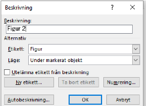

# [ORU_H1_Heading 1]

Start to write here. The template will automatically use ORU_Body text unless you make changes manually. Do not add extra space between headings and body text or between paragraphs unless you have a specific reason to do so.

When you want to start a new paragraph, just press Enter.

## [ORU_H2_Heading 2]

ORU_Body text will always follow the style sheets for headings (ORU_H1–ORU_H5).[^1]

Citation/quotation. Use the stylesheet ORU_Quotation for all longer quotations and an indent and smaller font will automatically be used [@Zomer-2016; @Arbaje-2008].

[^1]: When you insert a new foot- or endnote you should click on [Tab] before you write the text to ensure the text is aligned correctly.

### [ORU_H3_Heading 3]

Replace this text.

#### [ORU_H4_Heading 4]

Replace this text.

# ORU_H1_Heading #1

If you need numbered headings, please use the style sheets ORU_H1_Heading #1–ORU_H4_Heading #4, see below. Otherwise delete this page.
When you want to start a new paragraph, just press Enter.

## ORU_H2_Heading #2

ORU_Body text will always follow the style sheets for headings (ORU_H1_Heading #1–ORU_H4_Heading #4).

### ORU_H4_Heading #3

ORU_Body text will always follow the style sheets for headings (ORU_H1_Heading #1–ORU_H4_Heading #4).

#### ORU_H4_Heading #4

ORU_Body text will always follow the style sheets for headings (ORU_H1_Heading #1–ORU_H4_Heading #4).

# Use the built-in format lists

By using the built-in format lists you ensure that the structure is correct also for those who use different kinds of accessibility aids.

## Letter list

a. ORU_Letter list – Et vel mossus moluptatio. Rum non re nam et di dipsam quia ditibus earum nonem niendebis dolorepro.
b. Et re alist, volorent evenduntion pora illam, sequod quat escil ilicatendis nem expersp ercidi tem.

## Bulleted list

- ORU_Bullet list - Et vel mossus moluptatio. Rum non re nam et di dipsam quia ditibus earum nonem niendebis dolorepro.
- Et re alist, volorent evenduntion pora illam, sequod quat escil ilicatendis nem expersp ercidi tem.

## Numbered list

1. ORU_Numbered list – Et vel mossus moluptatio. Rum non re nam et di dipsam quia ditibus earum nonem niendebis dolore-pro.
2. Et re alist, volorent evenduntion pora illam, sequod quat escil ilicatendis nem expersp ercidi tem.

When you want body text to apply again, you must select the style sheet ORU_Body text.

# Insert pictures, figures and tables

To insert pictures, select the style sheet ORU_Insert picture.

{width=11.4cm height=4.73cm}

{width=8.57cm height=6.22cm}

## Use the tool for tables and charts

Use the Table tool and Chart tool in Word to insert tables and charts. The tools, if used correctly, support accessibility.

| ORU_Table_ Heading | ORU_Table_ Heading | ORU_Table_ Heading | ORU_Table_ Heading |
|--------------------|--------------------|--------------------|---------------------|
| ORU_Table_ content | ORU_Table_ content | ORU_Table_ content | ORU_Table_ content  |
| ORU_Table_ content | ORU_Table_ content | ORU_Table_ content | ORU_Table_ content  |

: Table 1. Table descriptions are normally inserted above the table.

# References with/without numbers {#references-without-numbers}

Use a .csl file numbered (e.g. vancouver.csl) or unnumbered (e.g. vancouver-author-date.csl) style. Specify which style you want in the YAML front matter `csl: your-style-file.csl` at the top of the document or in `_quarto.yml`.

Below are an example of numbered references.
